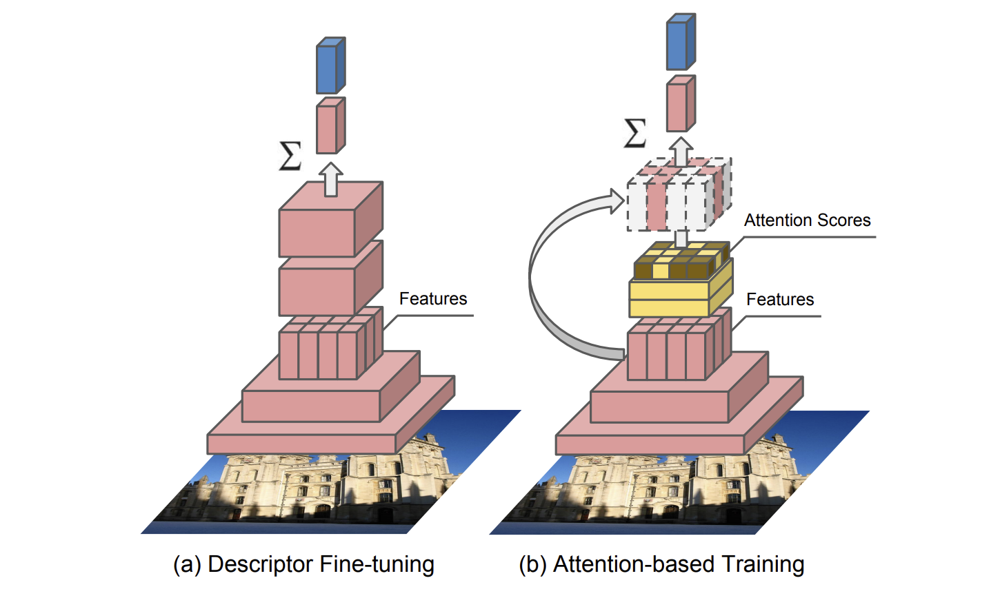

# DeLF-easy-training

This repository was implemented based on the DeLF [paper](https://arxiv.org/abs/1612.06321), and it was mainly focused on the parts that was specified in the paper but not implemented in the [tensorflow/delf](https://github.com/tensorflow/models/tree/master/research/delf) repository. We recommend you to follow those paper and repository if you are not familiar with DeLF.

## Usage of this repository
You can implement your own [CBIR(Content-based image retrieval)](https://en.wikipedia.org/wiki/Content-based_image_retrieval) system based on the DeLF model with this repository. This repository provides two cases depending on whether you are learning the model yourself or not. To build a custom retrieval system specific to your custom dataset, you will need to train your own model along with following [instructions](https://github.com/Golden-Retrieval/DeLF-easy-training/blob/master/INSTALL_INSTRUCTIONS.md). However, if the [tensorflow hub model](https://tfhub.dev/google/delf/1) learned in the [Landmark dataset](https://www.kaggle.com/c/landmark-recognition-challenge) is sufficient to your system, it is not necessary to learn (Then, you will need to tune some parameters to use tensorflow hub model).

## Composition of DeLF
(you can also get this content in section 4 of the [paper](https://arxiv.org/abs/1612.06321))

1. Descriptor Fine-tuning (Section 4.1)
2. Attention-based Training (Section 4.2)
3. Retrieval System (Section 4.4)

## Implementation

### Training
By importing [`DelfV1`](https://github.com/tensorflow/models/blob/master/research/delf/delf/python/delf_v1.py#L60) class from [tensorflow/delf](https://github.com/tensorflow/models/tree/master/research/delf) repository, we implemented training code for the case of using custom dataset. You can follow above 2 trianing steps (Descriptor Fine-tuning & Attention-based Training) by following this repository for your custom model.

### Retrieval

When you are planning to implement an image retrieval system, [Matching image](https://github.com/tensorflow/models/blob/1af55e018eebce03fb61bba9959a04672536107d/research/delf/delf/python/examples/match_images.py) one by one is not enough. Thus, as specified in the paper, we implemented Product Quantization to aggregate and retrieve images from a large number of features. It could be possible through facebook's faiss library.

## Instructions
- [Installation](https://github.com/Golden-Retrieval/DeLF-easy-training/blob/master/INSTALL_INSTRUCTIONS.md)
- [Training](https://github.com/Golden-Retrieval/DeLF-easy-training/blob/master/DeLF_train_tutorial.ipynb)
- [Inference](https://github.com/Golden-Retrieval/DeLF-easy-training/blob/master/delf_inference_v1.py)

## Reference

- [Large-Scale Image Retrieval with Attentive Deep Local Features](https://arxiv.org/abs/1612.06321)
- [tensorflow/models/research/delf](https://github.com/tensorflow/models/tree/master/research/delf)
- [facebookresearch/faiss](https://github.com/facebookresearch/faiss)
- [tfhub/delf](https://tfhub.dev/google/delf/1)

## Maintainers

- Hyeonseo Nam / [@gud2great](https://github.com/gud2great)
- Yunsoo Jung / [@yunsu3042](https://github.com/yunsu3042)

